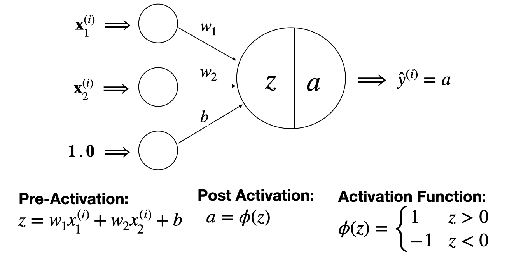

## The Perceptron

In this notebook, we will introduce the Perceptron, a type of single neuron model.

The Perceptron is a fundamental algorithm in machine learning and artificial intelligence. It is a type of binary classifier that can learn to make predictions based on input data.

The Perceptron algorithm was developed by Frank Rosenblatt in 1957 and is inspired by the functioning of a biological neuron. It consists of a single artificial neuron that takes multiple inputs, applies weights to them, and produces an output.

Per Dr. Davila's notes, "The perceptron is a single neuron model with the *sign* activation function as depicted in the figure below:



The Perceptron algorithm is used for binary classification tasks, where the goal is to separate data points into two classes. It can learn to classify linearly separable data, but it may struggle with data that is not linearly separable.

### The Perceptron Algorithm

The Perceptron model is trained in 3 stages:

#### Phase 1: Preprocessing

Binary classifiers such as the Perceptron are meant to classify input data into two groups (yes or no, left or right, etc.) corresponding to 1/0 or 1/-1 outputs (depending on the selected activation function). To prepare the data, we must first determine the two intended output groups and classify our input data in numerical terms (1/0, 1/-1), at which point our data will be in an appropriate format that allows our model to be trained.

#### Phase 2: Prediction

The goal during the prediction phase is to apply the current model (with its initialized or updated weights and bias) to predict whether each instance in the dataset belongs to one of two classes.

**Weighted Sum Calculation:** For each input vector $X_i$ in the dataset, calculate the weighted sum of the inputs plus the bias. This is done using the formula: $Z = X_i \cdot w + b$, where $Z$ is the weighted sum, $X_i$ is the input vector for the ith training example, $w$ represents the weight vector, and $b$ is the bias.

2. **Apply Activation Function:** Apply the activation function to the weighted sum to determine the prediction. In the case of the Perceptron, this is typically a step function defined as: <br><br>
   $f(Z) = \begin{cases} 
      1 & \text{if } Z \geq 0 \\
      -1 & \text{otherwise}
   \end{cases}
   $
   <br><br>
   This step converts the weighted sum into a binary output (1 or 0), representing the predicted class for each input vector $X_i$.

This step is vital for evaluating the model's performance at any given point in the training process and for determining how the model weights need to be adjusted; the predictions made in this phase are compared against the actual class labels of the training examples to calculate the error for each prediction. This error measurement is critical for the Perceptron's learning process, as it informs how the weights should be updated in the following phase.

#### Phase 3: Updating weights

The goal is to minimize the total misclassified data points, so by iterating through the algorithm, the separation line moves in space and after a certain number of epochs, the algorithm classifies the data correctly.

In the Perceptron learning rule, predicted output is compared with known output; if they do not match, error is propagated backward to allow weight adjustment to happen.

Finally, the Perceptron algorithm follows these steps:

Inputs: data points and a number of epochs
1. Initialize the weights and bias to small random values.
2. For each training data instance:
    - Calculate the weighted sum of the inputs and the bias.
    - Apply an activation function (usually a step function) to the weighted sum to obtain the output.
    - Update the weights and bias based on the error between the predicted output and the true output.
3. Repeat step 2 until the algorithm converges or the maximum number of epochs is reached.


Here is an example of how to implement the Perceptron algorithm in Python:

```py
import numpy as np

class Perceptron:
    def __init__(self, learning_rate=0.5, max_iterations=50):
        self.learning_rate = learning_rate
        self.epochs = max_iterations

    def train(self, X, y):
        self.weights_ = np.random.rand(1 + X.shape[1])
        self.errors_ = []

        for _ in range(self.epochs):
            errors = 0
            for xi, target in zip(X, y):
                update = self.learning_rate * (self.predict(xi) - target)
                self.weights_[:-1] -= update*xi
                self.weights_[-1] -= update
                errors += int(update != 0)
            if errors == 0:
                return self
            else:
                self.errors_.append(errors)
            
        return self
    
    def net_input(self, X):
        return np.dot(X, self.weights_[:-1]) + self.weights_[-1]
    
    def predict(self, X):
        return np.where(self.net_input(X) >= 0.0, 1, -1)
```