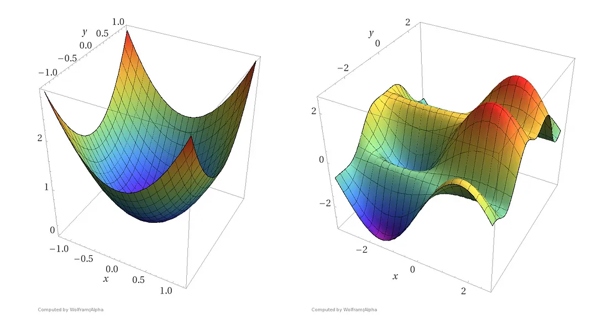

## Gradient Descent

In this notebook, we will introduce gradient descent, a well-known optimization algorithm of convex functions.

Gradient descent is best explained with an analogous scenario. Say you are around down a hilly area and you want to reach the valley with the lowest altitude (see image below). 

Gradient descent is a method in finding where the lowest valley is.

### Simple Gradient Descent Algorithm

From Dr. Davila's notes:

"Clearly the function $f(w) = (w - 2)^2 + 1$ has a **global minimum** at $w = 2$. Supposing we did not already know the answer, how could we find it? That is, we wish to solve:

$$
\min_{w\in \mathbb{R}} f(w) \:\:\:\:\:\:\:\:\:\:
$$

This class of problems falls into the realm of *unconstrained continuous optimization*.

Suppose we first guess that the minimum value of $f(w)$ occurs at $w_0 = 5$. The general idea behind gradient descent is to use the gradient (the derivative for single variable functions) to *provide a direction to explore* (this means gradient descent is a **first-order method**). For example, with our function $f$ and an initial guess $w_{0} = 5$, suppose we are able to calculate the value of the gradient (the derivative) of $f(w)$ at $w_{0} = 5$. This numerical value will give us the *slope of the tangent line* to $f(w)$ at $w_{0}$. Note that $f'(w)$ = $2(w-2)$.

Recall that the tangent line implies a direction of descent. That is, at the point $(5, f(5))$, the tangent line has a positive slope. This indicates that we need move in the negative direction (to the left of $w_0 = 5$) if we wish to move to a smaller value of $f(w)$. That is, **we need to move in the direction opposite of the sign of the derivative of $f(w)$ at $w_0 = 5$**. We repeat this process until a maximum number of iterations is reached or the gradient at $w_n$ is 0 (in other words, we are at a minimum). 

### - But how far should we move? 
The value of how far to move in the opposite sign of the derivative of $f(w)$ at $w_0 = 5$ is called the **learning rate**, and is typically denoted by $\alpha$. The process of multiplying the derivative of $f(w)$ at $w_0 = 5$ by the learning rate and forming a new choice of $w$ by subtracting this quantity from $w_0$ is called **gradient descent**. For example, we may apply gradient descent at $w_0$ and form a new $w$, say $w_1$, with the following update:

$$
w_{n+1} = w_n - \alpha f'(w_n) \:\:\:\: (\text{GD Update Rule for a univariate function})
$$

The choice of $\alpha$ in machine learning is typically found by experimentation, though more sophesticated techniques are available, such as *line-search* and *trust-region* methods."

We repeat the calculation of the gradient and change of the parameters until we reach a maximum number of iterations or we find that we are at a minimum. 

So, to summarize, the gradient descent process is as follows:

1. **Initialize parameters:** Start with an initial guess of the parameters (weights) of the function you want to minimize.

2. **Compute the gradient:** Calculate the gradient of the function with respect to each parameter. The gradient will point in the direction of the steepest ascent.

3. **Update the parameters:** Modify the parameters in the opposite direction of the gradient by a small step, with the size of the step controlled by the learning rate $\alpha$.

4. Repeat 2 and 3 until the maximum number of iterations is reached, or $f(w_n)$ = 0.

### Simple Gradient Descent for Functions of Several Variables

All of the same ideas apply to gradient descent for functions of several variables. As briefly mentioned above, we will take the gradient (the multivariate equivalent derivative) instead of the derivative:

$$
w \leftarrow w - \alpha \nabla f(w) \:\:\:\: (\text{GD for a multivariate function})
$$

### Sub-Optimal Convergence

Suboptimal convergence is a disadvantage of simple gradient descent where the algorithm situationally converges to a solution that is not the global minimum. Among other things, local minima, saddle points, and too high/too low of a learning rate can cause suboptimal convergence in the gradient descent approach.

### The Use of Gradient Descent

Gradient descent in respect to machine learning is used to minimize a cost/loss function. A common measure of a model's performance is the Mean Squared Eror (MSE):

$MSE = \sum_{i=1}^{n}(y_{i} - \hat{y_{i}})^2$,

where $y_{i}$ is the true value and $\hat{y_{i}}$ is the predicted value.