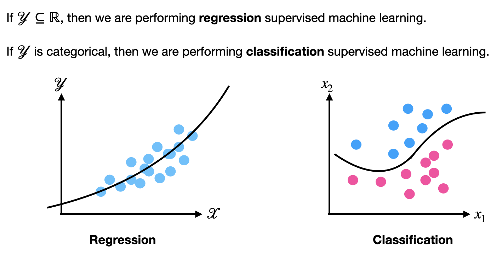

## Linear Regression

In this notebook, we will introduce Linear Regression, a fundamental concept of Machine Learning.

*Note: no notebook was created for this topic, as it is showcased in the Gradient Descent notebook already.*

Linear regression (in specific, simple linear regression) is a method of modeling a relationship between dependent variable $x$ and a dependent variable $y$. The end goal of linear regression is to find a linear equation that accurately represents the input data $(x_0, y_0), (x_1, y_1),..., (x_n, y_n)$.

Linear regression can be used for both prediction (predicting future values of $y$ given new values of the $x$) and inference (understanding the relationship between the $y$ and $x$).

### Regression vs. Classification

### Assumptions of Linear Models

In linear regression, there are assumptions made about the model in order for it to work:

1. Linearity: $y$ should have a linear relationship with the independent variable(s). 
2. Normality: $x$ and $y$ should be normally distributed.
3. Homoscedasticity: The residual spread should be constant and random (there should be no pattern when plotting the residuals against fitted values)
4. Independence: There should not be significant dependence/correlation between the independent variables (if there are multiple).

### Linear Regression Single Neuron Model

The cost function we will use for the SLR model is mean squared error ($MSE$):

$$
MSE = \frac{1}{2N}\sum_{i=1}^{n}\Big(y_{i} - \hat{y}_{(i)}\Big)^2, 
$$

where 

$$
\hat y_i = wx_i + b 
$$

Now, we can construct a signle neuron model with a linear activation function and the $MSE$ cost function.

To create an accurate linear model, we will want to minimize the weight vector and the bias in order to minimize the $MSE$.

Since the $MSE$ function is differentiable for both the weight vector $w$ and the bias $b$, we can use the gradient descent method to minimize the $MSE$. That is,

$$
w \leftarrow w - \alpha \frac{\partial C}{\partial w}
$$

$$
b \leftarrow b - \alpha \frac{\partial C}{\partial b}
$$

where:

1. $\frac{\partial MSE(x_i, y_i)}{\partial w} = (wx_i + b - y_i)x_i = (\hat y_i - y_i)x_i$
2. $\frac{\partial MSE(x_i, y_i)}{\partial b} = (wx_i + b - y_i) = (\hat y_i - y_i)$

for each $(x_i, y_i)$. 

Putting this together,

1. $$\frac{\partial MSE(\mathbf{X}, y)}{\partial w} = \frac{1}{n}\sum_{i=1}^{n}\Big(\hat y_i - y_i\Big)x_i$$
2. $$\frac{\partial MSE(\mathbf X, y)}{\partial b} = \frac{1}{n}\sum_{i=1}^{n}\Big(\hat y_i - y_i\Big)$$

Calculating the full gradient with respect to all training data and applying the gradient descent algorithm is called **batch gradient descent**.

### Batch Gradient Descent Algorithm
1. For each epoch **do**
2. Calculate the full gradient by finding $\frac{\partial MSE(\mathbf{X}, y)}{\partial w}$ and $\frac{\partial MSE(\mathbf{X}, y)}{\partial b}$.
3. $w \leftarrow w - \alpha \frac{\partial MSE(\mathbf{X}, y)}{\partial w}$
4. $b \leftarrow b - \alpha \frac{\partial MSE(\mathbf{X}, y)}{\partial b}$

From Dr. Davila's notes:

By finding $w$ and $b$, we will obtain the linear model with the minimized $MSE$.  However, *this method can be very slow and use a lot of memory*, especially when the number of training data is very large (possibly millions). More importantly, **batch gradient descent is not necessary to find local minima**. 

The most common way work around for this problem is to update $w$ and $b$ by calculating the gradient with respect to one entry of data at a time. This technique is called **stochastic gradient descent** and is one of the primary tools in training deep neural networks and simple single neuron models. 

### Stochastic Gradient Descent Algorithm
1. For each epoch **do**
2. For $i = 1, \dots, N$ **do**
3. Calculate $\frac{\partial MSE(x_i, y_i)}{\partial w}$ and $\frac{\partial MSE(x_i, y_i)}{\partial b}$.
4. $w \leftarrow w - \alpha \frac{\partial MSE(x_i, y_i)}{\partial w}$
5. $b \leftarrow b - \alpha \frac{\partial MSE(x_i, y_i)}{\partial b}$

For single neuron models in practice, stochastic gradient descent should be the preferred way for optimizing the weights and bias by minimizing the cost function.

As a result, we obtain

$$
\hat y = wx + b.
$$