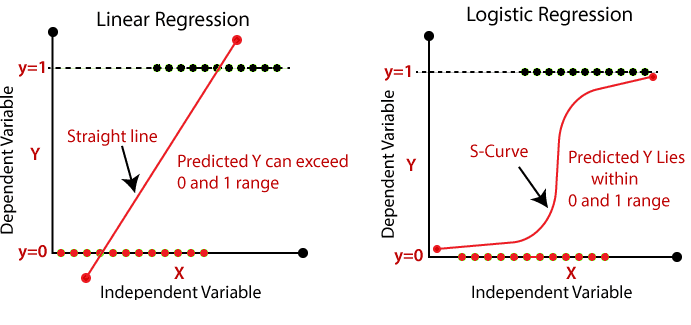
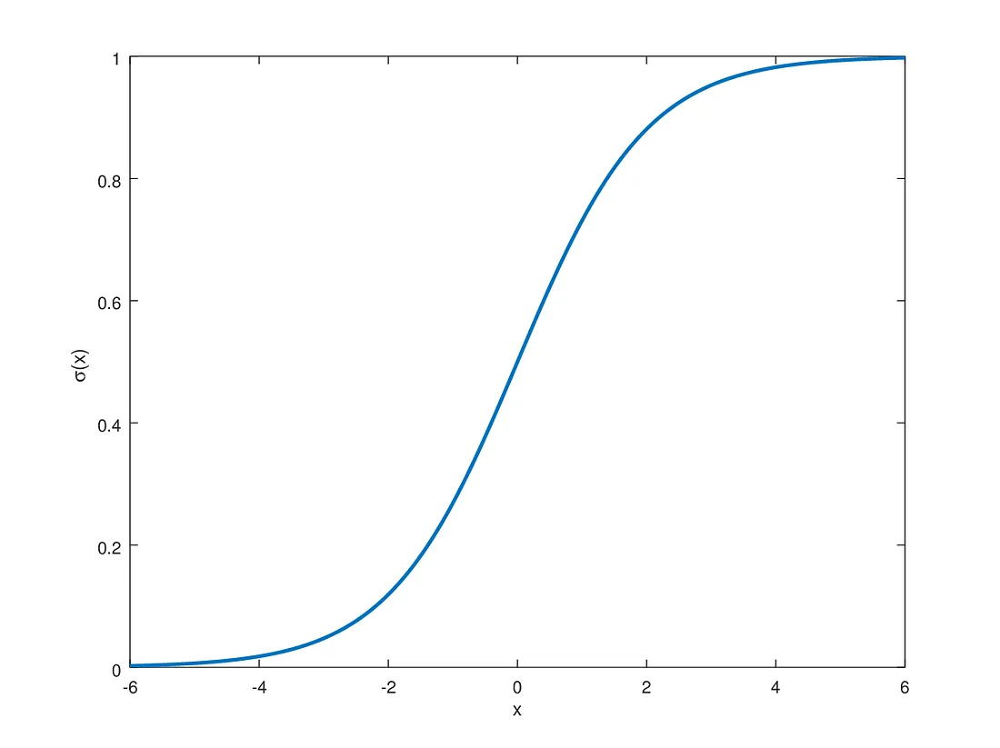

## Logistic Regression

In this notebook, we will introduce Logistic Regression.

Logistic regression is a machine learning algorithm commonly used for binary classification purposes, such as determining if songs should be recommended (yes), or not recommended (no) to a user. This notebook will focus specifically on single neuron logistic regression for binary classification.

### Assumptions of Logistic Regression

Logistic Regression assumes:
- The data is labeled
- There is more than one label used in the data (ex. not everything can be a yes, because then the model would be pointless)
- Input data is independent
- No (or little to no) colinearity between independent variables
- Linearity of independent variables and log odds
- Large sample size (for accuracy reasons)

Further information about assumptions can be found [here](https://www.statisticssolutions.com/free-resources/directory-of-statistical-analyses/assumptions-of-logistic-regression/).

### The Sigmoid Function

As with the Perceptron and in Linear Regression, an activation function must first be selected. The *sigmoid* function is commonly chosen:

$$
\sigma(z) = \frac{1}{1 + e^{-z}}
$$

The *sigmoid* function is commonly used as its values range from 0 to 1, similar to probabilities ranging from 0 to 1:

With this function, we can obtain a pre-activation value that represents a probability, and classify based on that probability. The most commonly used rule of thumb for post-processing is if the predicted probability is *greater than or equal to* .5, it is labeled as a 1 (reccomend to a user), and if it is *less than* .5, then it is labeled as a 0 (don't reccomend to a user).

### The Binary Cross Entropy Loss Function

Our cost function, the binary cross entropy loss function, is: 

$$
C(w, b; x^{(i)},y^{(i)}) = -y^{(i)}\log \hat{y}^{(i)} - (1-y^{(i)}) \log (1 - \hat{y}^{(i)})
$$

This cost function can be derived by taking the maximum likelihood estimation (MLE) of the conditional bernoulli probability:

$$P(y_i|x_i)=\hat{y}^{y}(1-\hat{y})^{1-y}$$

This derivation can be found [here](https://towardsdatascience.com/an-introduction-to-logistic-regression-8136ad65da2e).

In logistic regression, we do not have to assume that the data is linearly separable, as the function is merely classifying probablistically. However, if the data is linearly separable, we will obtain a much more accurate model.

### Spotify Applications of Logistic Regression

- **Radio Feature:** Similar to playlist generation, logistic regression could help determine the next song to play in a radio feature by predicting the likelihood of a song being appreciated by the user based on their previous interactions.

- **Marketing Campaigns:** By predicting user responses to different marketing strategies, Spotify can tailor campaigns more effectively, targeting users with promotions and offers they're more likely to appreciate and respond to.

- **Product Features A/B Testing:** When testing new features (like a new interface or algorithm change), logistic regression can be used to predict and evaluate user engagement or satisfaction, helping Spotify make data-driven decisions about which features to roll out broadly.

Credit to Dr. Davila's notes as well as [this article](https://towardsdatascience.com/an-introduction-to-logistic-regression-8136ad65da2e), where a handful of the content in this file is adapted from.