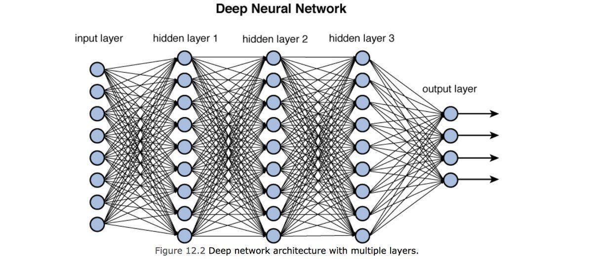

## Neural Networks

Neural networks are a core component of machine learning. They are models represented as computational graphs and are inspired by the structure and function the human brain. Neural networks contain an input layer, a sequence of hidden layers consisting of multiple single
neurons, and an output layer. This results in a highly composite function that can be used for regression or classification tasks in supervised learning (which we will focus on in this notebook), dimensionality reduction, and deep learning.

### Components of Neural Networks

A neural network is made up of several components:

- **Input Layer**: Receives raw data that is fed into the network and passes it on to the next layer.

- **Hidden Layer(s)**: Receives weights from a previous layer (either the input layer or another hidden layer) and performs computations/ updates the weights, and passes the weights to the next layer. Depending on the size of the neural network, there may be several or no hidden layers.

- **Output Layer**: The final results. Either has a number of neurons that is equal to the number of output classes (for classification) or a single neuron (for regression), and uses an activation function that maps to the desired output format.

-**Connections and weights**: Connections transfer the output of one neuron *i* to the input of another neuron *j*. The connection between *i* and *j* is assigned a weight $w_{i,j}$, or the strength of the connections between the two neurons.

-**Activation function**: Defines the output of a neuron given input(s). The activation functions help introduce non-linearity into the network, which allow it to learn complex patterns in the data.

### Types of Neural Networks

Types of Neural Networks include:

- The Feedforward Neural Network: A neural network where connections don't form a cycle (information only moves in one direction). The information moves from the input nodes through the hidden nodes and finally to the output nodes. Within this type of neural networks, examples include the [Single-layer Perceptron](https://github.com/gbd2/INDE-577/tree/main/supervised-learning/1%20-%20Perceptron) and the Multi-layer Perceptron.

- The Recurrent Neural Network (RNN): A neural network where connections do form a directed cycle. This property allows the network to exhibit dynamic temporal behavior, meaning that this network can process arbitrary sequences of inputs. RNN's are commonly used in handwriting, speech, and other motion recognitions.

### Activation Functions

As mentioned earlier, activation functions help introduce non-linearity into the network, which allow it to learn complex patterns in the data. Some common activation functions include:

-**Linear function (no change)**: $$\text{linear}(z_i)=z_i$$
Used in linear regression.

-**Sigmoid function**: $\sigma(z_i) = \frac{1}{1 + e^{-z_i}}$

Used in logistic regression.

-**Tanh function**: $\tanh(z_i) = \frac{\sinh(z_i)}{\cosh(z_i)} = \frac{e^{z_i} - e^{-z_i}}{e^{z_i} + e^{-z_i}}$

Used in Multilayer Perceptron Neural Networks.

*Note: the examples of when activation functions are used are just one of many examples of their use.*

### Backpropogation for Neural Networks

Backpropagation is a method used for calculating the gradient of the loss function in neural networks. By passing error information back through the network, the information is used to update the weights in a direction that minimally decreases the error.

#### Finding the Gradient with Backpropagation:

The gradient can be found using backpropagation as follows:

- **Initialize**: Given a feature vector $x^{(i)}$, let $a^0 = x^{(i)}$.  

- **Feedforward**: For $\ell$ = 1,...,$L$, compute $z^\ell = w^{\ell}a^{\ell-1} + b^\ell$ and $a^\ell = \sigma(z^\ell)$.

- **Output error**: Compute $\delta^L = \nabla_aC \otimes \sigma'(z^L)$.

- **Backpropogate**: For $\ell = L-1, \dots, 1$, compute $\delta^{\ell} = \left [(w^{\ell +1})^{T}\delta^{\ell +1} \right] \otimes \sigma'(z^{\ell})$.

### Applications of Neural Networks:

- **Music Recommendation Systems**: Extract meaningful features from music tracks to group similar songs together and recommend songs that are similar to ones labeled as preferred by the user.

- **Audio Analysis**: Utilize neural networks to analyze and extract complex audio features such as rhythm, pitch, and timbre. Use these features to enhance sound quality, match songs with similar acoustic profiles, and improve the overall audio experience for users.

- **Content Curation and Classification**: Employ neural networks to automate the tagging and categorization of audio content by genre, mood, and instrumentation. This streamlined classification system supports efficient content management and more nuanced, targeted recommendations for users.

Credit to Dr. Davila's notes as well as [this article](https://towardsdatascience.com/a-gentle-introduction-to-neural-networks-series-part-1-2b90b87795bc), where a handful of the content in this file is adapted from.