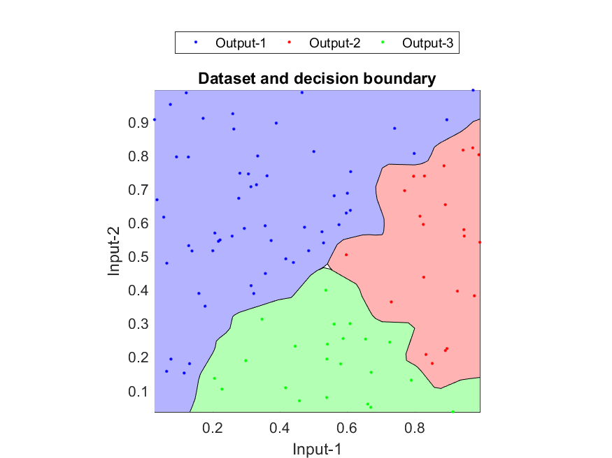

## $K$-Nearest Neighbors

$K$-Nearest Neighbors (KNN) is a simple machine learning algorithm that can be used in both regression and classification. KNN's fundamental goal is to predict the label/value of a data point based on the labels of its nearest neighbors (so, naturally, it depends on the notion that similar data exists in proximity).

### KNN Algorithm

The $K$-Nearest Neighbors Procedure is as follows:

1. Specify a value of $k$ (see below for choosing a $k$)
2. For each example in the data do
    - Calculate the distance between the query example and the current example from the data
    - Add the distance and the index of the example to an ordered collection
3. Sort the ordered collection of distances and indices from least to greatest of distance
4. Pick the first $k$ entries from the sorted collection
5. Get the labels of the selected $k$ entries
6. If regression, return the mean of the $k$ labels. If classification, return the mode of the $k$ labels.

### Choosing $k$

Choosing a $k$ has no real set method. Here are some options for choosing a $k$:

- Pick small $k$ values: can be noisy, will have a higher influence on the result.
- Pick larger $k$ values: results in smoother decision boundaries and lower variance, but increased bias and computational expense.
- Select using cross-validation: Take a small portion from the training dataset and call it a validation dataset, and then use the same to evaluate different possible values of $k$. Pick the one with the best performance. Results in high accuracy, but can be computationally expensive to solve.
- Choosing $k = \sqrt{n}$, where $n$ is the number of samples in the training data (a good heuristic).

While all of these are options, it is generally a good practice to keep the value of $k$ odd in order to avoid confusion between 2 classes of data.

### Applications of KNN

- **Music Recommendation System**: Use KNN to recommend songs that are sonically similar to a user’s recently played tracks.

- **Collaborative Filtering for Playlist Generation**: Use KNN to predict a user's interest in a track based on playlist data from similar users. Here, KNN looks for users who share similar playlist content and suggests songs from their playlists that the original user might not have heard yet.

- **Genre Classification**: KNN can help in automatic genre classification of tracks based on their audio features. This can be particularly useful for categorizing and organizing vast libraries of music.

- **Mood-Based Classification**: Spotify can use KNN to classify songs into mood-based categories (e.g., happy, sad, energetic). This can improve personalized playlists that fit a user's current mood.