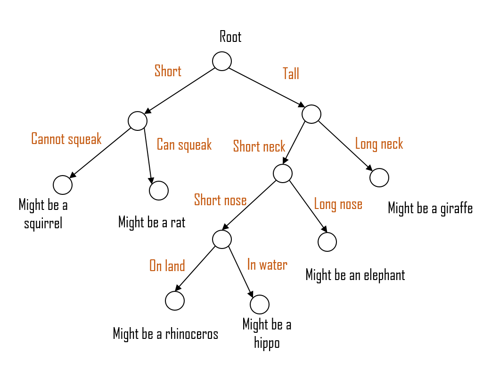

## Decision Trees

Decision trees are machine learning models that learn decision rules inferred from the training data and can be used in classification or regression.

### How Decision Trees Work

Decision trees work by repeatedly splitting the data into smaller subsets based on patterns found in the training data, forming a tree-like structure. The challenge in decision trees is finding which attributes need to be considered as the one to split off of at each level. To solve this problem, a criterion such as *information gain* (for categorial attributes) or the *gini index* (for continuous attributes) is commonly used.

### Decision Tree Algorithm

The procedure for building a Decision Tree is as follows:

1. **Select the Optimal Attribute**:
   - At each node, evaluate and choose the best attribute for splitting the dataset. Use metrics like Information Gain, Gini Impurity, or Gain Ratio to determine the most effective attribute.
   - Place this attribute at the root of the tree for the initial split, or as the decision attribute at the current node.

2. **Partition the Dataset**:
   - Divide the dataset into subsets, where each subset contains data instances that share the same value for the selected attribute.
   - Ensure that the data within each subset is homogeneous with respect to the selected attribute.

3. **Recursively Apply Steps 1 and 2**:
   - Continue applying steps 1 and 2 to each resulting subset.
   - Stop splitting when one of the following conditions is met in every subset:
     - All instances in the subset belong to the same class.
     - There are no remaining attributes to use for further splitting.
     - The number of instances in the subset falls below a predefined threshold, to avoid overfitting.

### Overfitting

Decision trees have a tendency to overfit. To solve this, it is common to use the approaches of pre-pruning and post-pruning: 

- **Pre-pruning**: Stop the construction of the decision tree a bit early. It is preferred not to split a node it its goodness measure is below a threshhold, but it's difficult to choose a stopping point.

- **Post-pruning**: Build a complete tree. If the tree demonstrates overfitting, then prune using cross-validation data to check the effect.

### Applications of Decision Trees

- **Churn Prediction**: Use decision trees to predict which users are at risk of cancelling their Spotify subscriptions. By analyzing user activity patterns, subscription levels, customer service interactions, and other relevant features, decision trees can identify key indicators of dissatisfaction or disengagement.

- **Contextual Music Recommendations**: Based on different inputs such as time of day, current activity (like working out, relaxing, studying), and recent listening history, decision trees can decide what type of music to recommend next. For instance, if a user often listens to upbeat pop music during workouts, the decision tree might prioritize similar tracks during future gym sessions.

- **System Maintenance Prioritization**: Decision trees can be employed to prioritize system issues based on urgency and severity. By classifying issue tickets into various categories, Spotify can effectively route and handle system problems, enhancing system maintenance efficiency and maximize operations.

Credit to Dr. Davila's notes as well as [this article](https://towardsdatascience.com/a-simple-introduction-to-k-nearest-neighbors-algorithm-b3519ed98e), where a handful of the content in this file is adapted from.

