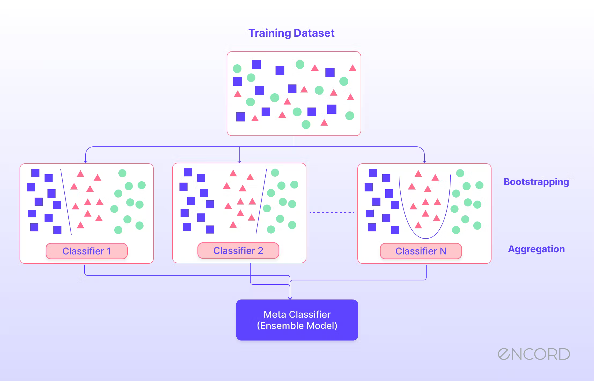

## Ensemble Methods

Ensemble methods (also referred to as ensemble learning) is a machine learning technique that merges multiple machine learning models to increase accuracy in predictions.

The most common types of ensemble methods are *bagging* (bootstrap aggregating) and *boosting*. 

### Bagging and Boosting

1. **Bagging:** 
    - **Purpose:** Reduces variance and requires no distributional assumption of the data.
    - **How it works:** Multiple subsets of the original training data are created with replacement (bootstrap), and a model is trained separately on each subset. The final prediction is typically the average of these models for regression, or the majority vote for classification.
    - **Example:** Random Forests are an extension of bagging where each tree in the ensemble is built from a sample of data and a sample of features.

2. **Boosting:**
    - **Purpose:** Reduces bias and variance.
    - **How it works:** Sequential models are trained, each focusing on the mistakes of the previous ones. The subsequent model weights are adjusted in favor of those instances misclassified by previous models.
    - **Example:** AdaBoost (Adaptive Boosting) is an example of boosting where the models adjust the weights of previous incorrectly classified instances so that subsequent classifiers focus more on difficult cases.

### Random Forests

Random forests are a method for classification and regression that consists of building multiple decision trees and picking the average/majority vote of all of the decision tree models. This aids in mitigating the overfitting nature of decision trees during the training period.

The Algorithm for Random Forests is as follows:

1. Select $n$ random subsets from the training set

2. Train $n$ decision trees 
        - every subset is used to train one decision tree
        - the optimal splits for each decision tree are based on a random subset of features

3. Each individual tree predicts the records/candidates in the test set, independently.

4. Make the final prediction (either by majority vote or the average).

### Applications of Ensemble Methods

- Ensemble of Collaborative Filtering Models: Spotify might use an ensemble of different collaborative filtering models to recommend songs or playlists. Each model could be based on different user interactions (e.g., listens, likes, skips) or different subsets of users. By aggregating the recommendations from each model, Spotify can potentially offer a more robust and personalized user experience that captures a broader spectrum of user preferences.
- Sentiment Analysis Models: To enhance features like Spotify’s mood-based playlists, an ensemble of sentiment analysis models could be used to determine the emotional tone of songs. This might involve models trained on different aspects of the music, such as lyrical content and audio signals. The results from these models could be combined to assign mood labels to tracks, which are then used to create mood-specific playlists.
- Search Result Ranking: Ensemble methods could be employed to rank search results more effectively. By combining models that evaluate different aspects of relevance—such as user search history, popularity of tracks, contextual information (time of day, season), and similarity to previously liked songs—Spotify can deliver a search experience that is both dynamic and personalized to individual tastes.

