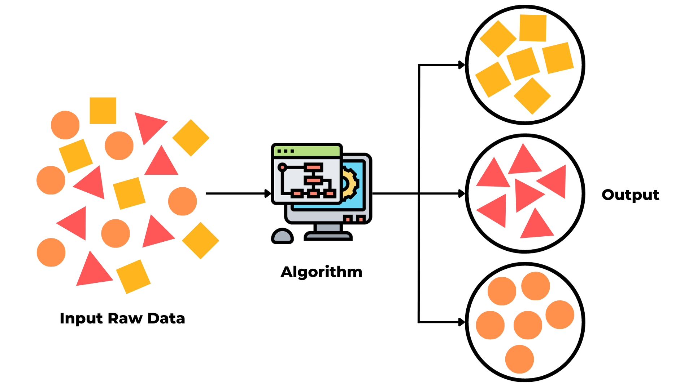

## Unsupervised Learning

Unsupervised learning is a type of machine learning that focuses on identifying patterns in a dataset without any pre-existing labels, or without any guidance on what the outcomes should be. The main goal is to explore the underlying structure of the data, discover hidden patterns, or group similar data points into clusters. Since there are no explicit outputs defined, unsupervised learning is fundamentally about dealing with data in its raw form and discovering the intrinsic properties of the data.

### Types of Unsupervised Learning

In this repository, we will cover these types of unsupervised learning:

- **Clustering:** This is perhaps the most common technique in unsupervised learning. Clustering algorithms seek to group a set of objects in such a way that objects in the same group (or cluster) are more similar to each other than to those in other groups. Examples include K-means clustering and DBSCAN.

- **Dimensionality Reduction:** Many datasets have a large number of features, some of which may be redundant or irrelevant. Dimensionality reduction techniques reduce the number of random variables under consideration, by obtaining a set of principal variables. Techniques such as Principal Component Analysis (PCA) are used to reduce the dimensions of the data, which can help in noise reduction, data visualization, and improving efficiency for other machine learning tasks.
